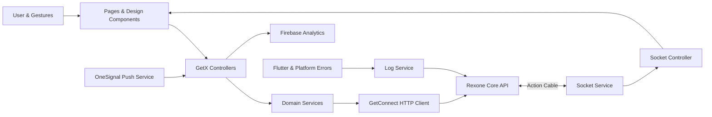

<a id="readme-top"></a>

<div align="center">

# Rexone Mobile

### A disciplined Flutter client, built to turn a powerful foundation into a seamless mobile product experience.

A production-minded mobile foundation for authenticated applications. Identity, payments, access control, media, AI, real-time delivery, push notifications, product analytics, in-app updates, localization, client telemetry, and reusable design primitives meet here—not as disconnected demos, but as one cohesive mobile application.

Built under the same creed as Rexone Core and Rexone Web: **clear in thought, exact in structure, simple in use, and strong enough to endure what comes after launch.**

[](https://flutter.dev/)
[](https://dart.dev/)
[](https://pub.dev/packages/get)
[](https://firebase.google.com/)
[](https://onesignal.com/)

**Typed · Modular · Localized · Observable · Push-ready · Analytics-enabled · API-driven**

[Explore the foundation](#feature-map) · [Ecosystem Architecture](ECOSYSTEM.md) · [Run it locally](#getting-started) · [Meet the architecture](#architecture) · [Connect the API](#configuration--environment-management)

</div>

---

> 🏛️ **Unified Ecosystem**: For the complete cross-platform architecture, 100% feature parity matrix, and communication protocols between Core, Web, and Mobile, see **[ECOSYSTEM.md](ECOSYSTEM.md)**.

## Why Rexone Mobile?

A capable backend and a polished web app are only parts of the whole product. The mobile application must navigate device lifecycles, volatile network conditions, push notifications, app store version migrations, real-time socket events, platform sessions, biometric/passcode verification, and structured error telemetry.

Rexone Mobile exists so that work does not have to be reinvented for every mobile application built on Rexone Core.

This is not a template of screens pretending to be an architecture. Pages, controllers, services, models, bindings, design primitives, and telemetry pipelines have exact and deliberate responsibilities:

- **Controllers** own application state, user intent, and failure feedback.
- **Services** are thin, single-responsibility transport clients that interact directly with Rexone Core, Action Cable, Firebase, and OneSignal.
- **Design primitives** enforce consistent spacing, typography, and theme tokens across light and dark modes.
- **Observability listeners** automatically capture uncaught Flutter and platform errors and ship structured diagnostic payloads to Rexone Core's client log store.

The client is designed to **bend around the product**, never to make the product kneel before the foundation.

---

## The philosophy

Rexone Mobile follows the same doctrine as the ecosystem it serves:

> **Clarity before cleverness. Precision before haste. Simplicity without weakness. Strength without spectacle.**

The difficult part of mobile engineering is rarely rendering another screen. It is preserving a codebase that remains understandable when routes multiply, background workers fire, push payloads arrive while the app is backgrounded, API contracts evolve, and multiple developers build in parallel.

So the ambition was never to build the most complex state tree possible.

It was to build a **clear mobile foundation**—strong enough to carry ambitious products, flexible enough to surrender its shape to them, and disciplined enough that any developer can trace data from interaction to API and back without archaeology.

---

## Feature map

| Foundation             | What is ready                                                                            | Details                                                              |
| ---------------------- | ---------------------------------------------------------------------------------------- | -------------------------------------------------------------------- |
| **Identity**           | Email/passcode flow, OTP verification, recovery, Google sign-in, platform sessions       | [Authentication & security](#authentication--security)               |
| **Push Notifications** | OneSignal push messaging, permission management, user tag syncing, and click routing     | [Push notifications](#push-notifications)                            |
| **Product Analytics**  | Firebase Analytics screen tracking, auth lifecycle events, and telemetry                 | [Product analytics](#product-analytics)                              |
| **In-App Upgrades**    | Upgrader alert system supporting soft and hard store version prompts                     | [In-app version upgrader](#in-app-version-upgrader)                  |
| **Commerce**           | Products, Stripe Checkout WebView, subscriptions, and cancel/resume workflows            | [Payments & entitlements](#payments--entitlements)                   |
| **AI Assistant**       | Non-blocking queued chat, persistent room history, and Action Cable notifications        | [AI capabilities](#ai-capabilities)                                  |
| **Real Time**          | Action Cable WebSocket client, subscription channels, and global toast dispatching       | [Real-time delivery](#real-time-delivery)                            |
| **Observability**      | Flutter and platform error capture with automated client log delivery to Rexone Core     | [Client observability & telemetry](#client-observability--telemetry) |
| **Design System**      | Centralized design tokens, theme extensions, custom components, and light/dark modes     | [Design system](#design-system)                                      |
| **Localization**       | English, Spanish, and Burmese with dynamic runtime switching and `X-Locale` backend sync | [Localization](#localization)                                        |
| **Quality**            | Strongly typed Dart models, analyzer compliance, and automated localization test suite   | [Quality & testing](#quality--testing)                               |

---

## Architecture

Rexone Mobile keeps framework concerns explicit, responsibilities separated, and external providers isolated.



### Layer Boundaries:

- `lib/pages/` owns screen layouts and user interactions (`GetView<Controller>`).
- `lib/controllers/` coordinates business logic, reactive state (`Rx`), navigation, and error handling.
- `lib/services/` encapsulates HTTP communication, WebSockets, Firebase, OneSignal, and storage without synthetic error codes.
- `lib/design/` centralizes design tokens, theme definitions, extensions, and reusable UI components.
- `lib/bindings/` handles centralized dependency injection for services and controllers.
- `lib/models/` contains strongly typed JSON:API models and response envelopes.
- `lib/locales/` contains multi-language translations and runtime dictionary updates.
- `lib/config/` and `lib/constants/` manage environment definitions and constant keys.

---

## The client in detail

### Authentication & security

- **Smart Email Discovery**: Automatically checks user registration and confirmation state via `POST /v1/auth/peek`.
- **6-Digit Passcode**: In-memory passcode handling for sign-in and registration (passcodes never leak to persistent storage or route URLs).
- **Escalating Attempt Protection**: Reactive password retry limits and cooldown counters driven dynamically by rexone-core.
- **Email Confirmation**: 6-digit email OTP verification with countdown-guarded resend capabilities.
- **Google Sign-In**: Native Google OAuth flow with Rexone Core challenge token support for first-time signups.
- **Active Session Enforcement**: Sends `X-Platform: mobile` to ensure single-device active session rules enforced by the backend cache.
- **Session Replacement Handling**: Detects active session invalidation and gracefully routes the user to sign-in with localized feedback.

### Push notifications

- Powered by **OneSignal Flutter SDK** (`onesignal_flutter`).
- Native push notifications for Android and iOS (`remote-notification` background modes).
- User identification and tag synchronization (`syncUser(user)` and `clearUser()`) hooked directly into authentication state changes.
- Click listeners that route notifications and track conversion events via `AnalyticsService`.

### Product analytics

- Powered by **Firebase Analytics** (`firebase_core` & `firebase_analytics`).
- Automatic screen tracking via `FirebaseAnalyticsObserver` registered in `GetMaterialApp.navigatorObservers`.
- Pre-defined event tracking for sign-up, sign-in, sign-out, password resets, onboarding, and error captures via `Constants.analytics`.
- User ID tagging synchronized with authenticated sessions.

### In-app version upgrader

- Powered by **Upgrader** (`upgrader`).
- Configured in `main.dart` wrapping the root application builder.
- Checks App Store and Play Store releases to display customizable update dialogs for outdated installations.

### Payments & entitlements

- Product catalogue with one-time and recurring pricing.
- In-app Stripe Checkout handoff via WebView (`webview_flutter`).
- Subscription state management (Active, Scheduled for Cancellation, Expired).
- Safe end-of-period cancellation and resumption guarded by destructive confirmation dialogs.

### AI capabilities

- Non-blocking conversational AI assistant backed by Rexone Core and DeepSeek.
- Multi-room management with persistent chat history.
- Real-time response completion notifications delivered via Action Cable.
- Room deletion and chat clearing guarded by destructive confirmation prompts.

### Real-time delivery

- Real-time WebSocket connection to Rexone Core via Action Cable (`SolidCable`).
- Auto-reconnect and token refresh on authentication.
- Centralized `SocketController` dispatches notifications and manages global toast feedback.

### Client observability & telemetry

- Global error capture through `FlutterError.onError` and `PlatformDispatcher.instance.onError`.
- Structured diagnostic payloads (message, stack trace, device metadata, OS version, app version, local storage keys) delivered directly to Rexone Core's `POST /v1/log/clients`.
- Environment names validated against canonical backend schemas (`development`, `staging`, `production`).

### Design system

- Centralized design entry point via `import 'package:rexone_mobile/design/design.dart';`.
- Complete design tokens: `Design.spacing`, `Design.typography`, `Design.icons`, and `Design.timers`.
- Theme extensions for theme-aware colors and typography (`context.colors`, `context.typo`).
- Reusable components: `AppButton`, `AppInputField`, `AppPasscodeField`, `AppDialog`, `AppLoading`, `AppPage`, and `AppSnackbar`.
- Cohesive light and dark themes with persistent user preferences.

### Localization

- Fully localized into:
  - 🇬🇧 **English (`en_US`)**
  - 🇪🇸 **Spanish (`es_ES`)**
  - 🇲🇲 **Burmese (`my_MM`)**
- Complete parity across all user-facing texts with dynamic runtime GetX translation reload.
- Automatically sends `X-Locale` and `Accept-Language` headers on all HTTP requests to ensure backend responses match the user's selected language.

---

## Getting started

### Prerequisites

- **Flutter SDK**: `>= 3.11.5`
- **Dart SDK**: `>= 3.11.5`
- **Android Studio** / **VS Code** with Flutter extensions
- **Xcode** (for iOS development on macOS)
- **CocoaPods** (for iOS dependency management)

Verify your environment:

```sh
flutter doctor
```

### Installation

1. Clone the repository:

```sh
git clone git@github.com:rex-9/rexone-mobile.git
cd rexone-mobile
```

2. Install dependencies:

```sh
flutter pub get
```

3. Configure environment variables:
   Create `.env.dev`, `.env.uat`, or `.env.prod` in the project root:

```env
APP_NAME=Rexone
APP_VERSION=1.0.0
API_BASE_URL=http://10.0.2.2:3000
GOOGLE_SERVER_CLIENT_ID=your_google_server_client_id.apps.googleusercontent.com
ONE_SIGNAL_APP_ID=your_onesignal_app_id
ANDROID_APP_ID=com.rexone.mobile
IOS_APP_ID=com.rexone.mobile
```

4. Configure Firebase & Google Services:

- **Android**: Copy `android/app/google-services.json.example` to `android/app/google-services.json` and configure your Firebase project values.
- **iOS**: Copy `ios/Runner/GoogleService-Info.plist.example` to `ios/Runner/GoogleService-Info.plist` and configure your Firebase project values.

> [!NOTE]
> `google-services.json` and `GoogleService-Info.plist` are included in `.gitignore` to prevent credential exposure.

---

## Running the application

### Development:

```sh
flutter run --dart-define=APP_ENV=.env.dev
```

### Staging (UAT):

```sh
flutter run --dart-define=APP_ENV=.env.uat
```

### Production:

```sh
flutter run --dart-define=APP_ENV=.env.prod
```

---

## Quality & testing

Run static analysis:

```sh
flutter analyze lib/ test/
```

Run unit and localization parity tests:

```sh
flutter test
```

---

## Building for production

### Android APK:

```sh
flutter build apk --release --dart-define=APP_ENV=.env.prod
```

### Android App Bundle (AAB):

```sh
flutter build appbundle --release --dart-define=APP_ENV=.env.prod
```

### iOS Release:

```sh
flutter build ios --release --dart-define=APP_ENV=.env.prod
```

---

## Project structure

```text
lib/
├── bindings/             # GetX dependency injection (InitialBinding)
├── config/               # App configuration and environment resolution
├── constants/            # Centralized constants (app, json keys, log, analytics, enums)
├── controllers/          # GetX business logic controllers (Auth, Settings, Payment, AI, Socket)
├── design/               # Design system (tokens, components, extensions, themes, icons)
│   ├── components/       # Reusable atoms and molecules (Button, Input, Passcode, Dialog, Loading)
│   ├── elements/         # Design tokens (Colors, Spacing, Typography, Icons, Timers)
│   └── extensions/       # Theme context extensions
├── helpers/              # Utility helpers (API JSON:API parser, flags, validators)
├── locales/              # Multi-language translations (en_US, es_ES, my_MM)
├── models/               # Strongly typed models, pagination metadata, and response envelopes
├── pages/                # Application screens and flows
│   ├── auth/             # Auth flow (Welcome, Sign-In, Passcode, Profile, OTP, Recovery)
│   ├── ai_page.dart      # AI Assistant chat view
│   ├── payment_page.dart # Plans, subscriptions, and billing
│   ├── home_page.dart    # Main dashboard
│   └── settings_page.dart# Theme, language, and account settings
├── routes/               # GetX route declarations and auth route guards
└── services/             # Domain transport services (API, Auth, Payment, AI, Socket, Log, Analytics, Push)
```

---

## Author

**Rex (Rex9)**

- GitHub: [@rex-9](https://github.com/rex-9)
- Portfolio: [rex9.vercel.app](https://rex9.vercel.app)
- LinkedIn: [rex9](https://www.linkedin.com/in/rex9/)

_Built with ❤️ by Rex9_
